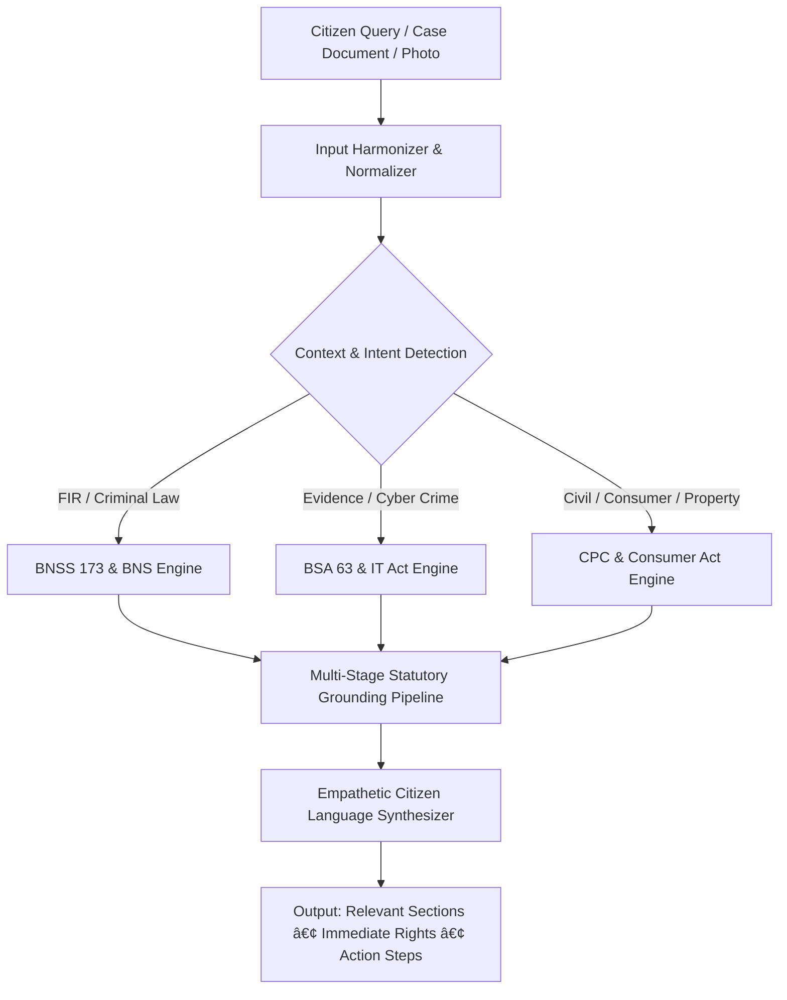

<div align="center">

# ⚖️ Nyayi (न्यायी) — India's AI Legal Intelligence Platform

<p align="center">
  <strong>Democratizing Indian Legal Literacy • BNS & BNSS 2023 Compliant • Citizen-First Justice Assistant</strong>
</p>

<p align="center">
  <a href="https://ai.nyayi.in"></a>
  <a href="https://nyayi.in"></a>
  <a href="LICENSE"></a>
</p>

<p align="center">
  
  
  
  
  
  
  
</p>

</div>

---

## 📌 Executive Overview

**Nyayi (न्यायी)** — derived from the Sanskrit word for *righteous justice* — is India's next-generation AI legal guidance platform. Built from the ground up for Indian citizens, Nyayi bridges the vast communication gap between complex statutory legal codes and ordinary people.

Whether facing a police FIR dispute, property inheritance conflict, cyber fraud loss, or consumer issue, Nyayi equips citizens with instant, empathetic, and actionable procedural understanding grounded in **Indian Penal jurisprudence (BNS, BNSS, BSA, CPC, and Consumer Protection Act)**.

> 💡 **Core Philosophy:** Legal literacy is a fundamental right. Law must be explained in the language citizens understand — without intimidating jargon or prohibitive advocate fees.

---

## 🧠 AI Neural Engine & Technical Architecture



### 1. Statutory Grounding Engine
Unlike generic chat models prone to legal hallucination, Nyayi's inference engine strictly incorporates Indian legal doctrines:
- **Bharatiya Nyaya Sanhita (BNS) 2023** (Replacing IPC 1860)
- **Bharatiya Nagarik Suraksha Sanhita (BNSS) 2023** (Replacing CrPC 1973)
- **Bharatiya Sakshya Adhiniyam (BSA) 2023** (Replacing Indian Evidence Act 1872)
- **Information Technology Act, 2000** & Cyber Fraud Recovery Protocols (1930 Helpline)
- **Motor Vehicles (Amendment) Act** & Traffic Challan Procedures

### 2. Document & Media Analysis Pipeline
Integrated into the chat composer via the **`+` Upload Drawer**, citizens can attach:
- 📄 **FIR Copies & Police Notices** (PDF, DOCX, TXT)
- 🖼️ **Legal Notices & Affidavits** (Scans & Screenshots)
- 📸 **Live Evidence Capture** (Direct camera capture on mobile)

The engine extracts key facts, identifies statutory exposure, and formats a structured action plan.

### 3. Progressive Web App (PWA) Mobile Architecture
- **100dvh Layout:** Zero unwanted browser address-bar scroll clipping.
- **Offline Shell & Service Worker (`sw.js`):** Fast loading with stale-while-revalidate asset caching.
- **Standalone Mode:** Native app look & feel when installed to Android or iOS home screens.

---

## ✨ Core Platform Capabilities

| Capability | Description | Statutory / Procedural Anchor |
| :--- | :--- | :--- |
| **⚖️ Fact-to-Law Engine** | Describe any real-world incident in plain words; AI diagnoses exact applicable sections and legal rights. | BNS 2023 / IPC Cross-Walk |
| **📋 Step-by-Step FIR Wizard** | Complete guide to filing an FIR, jurisdiction selection, Zero FIR rules, and remedies if police refuse. | BNSS Section 173(1), 175(3) |
| **📖 Case Law Simplifier** | Breaks down landmark Supreme Court and High Court judgments into 3-point citizen summaries. | SC / HC Jurisprudence |
| **📑 Legal Notice Drafter** | Generates formal, ready-to-print legal notices for money recovery, tenancy, cheque bounce, or consumer complaints. | Section 138 NI Act, CPC 1908 |
| **🚗 Traffic Fine Calculator** | Instant fine calculation, compounding rules, and virtual court resolution methods. | Motor Vehicles Act 2019 |
| **🎙️ Multilingual Voice AI** | Full voice conversation supporting **Pure Hindi (Devanagari)**, **English**, and conversational **Hinglish**. | Native Indian Voice Synthesis |
| **🚨 Emergency SOS System** | One-tap access to 112 (Police), 1091 (Women), 1930 (Cyber Crime), and 15100 (Free Legal Aid). | NALSA / MHA Helplines |

---

## 💻 Tech Stack & Infrastructure

<div align="center">

### Frontend & App Shell


### Backend & Cloud Infrastructure


### Security & Authentication


</div>

---

## 📂 Repository Directory Structure

```plaintext
Nyaya-Setu/
├── public/
│   ├── css/
│   │   └── style.css            # 100dvh Glassmorphic Responsive Design System
│   ├── js/
│   │   └── script.js            # Chat controller, media upload tray, speech synth
│   ├── images/
│   │   └── logo.png             # Official Nyayi brand logo (192px / 512px)
│   ├── auth.html                # Unified Auth: Google OAuth, GitHub, Email OTP
│   ├── index.html               # Main PWA application shell & composer
│   ├── manifest.json            # PWA standalone manifest configuration
│   └── sw.js                    # Service Worker caching engine
├── server.js                    # Production Node.js server (Auth, AI API, Resend, Admin)
├── users.json                   # Encrypted user records & authentication timestamps
├── LICENSE                      # Proprietary Software License & BCI Legal Disclaimer
└── README.md                    # Project documentation
```

---

## 🚀 Quick Start & Local Setup

### Prerequisites
- [Node.js](https://nodejs.org/) (v18.0.0 or higher recommended)
- Git installed

### 1. Clone the Repository
```bash
git clone https://github.com/Samfarhan/Nyaya-Setu.git
cd Nyaya-Setu
```

### 2. Environment Configuration
Create a `.env` file in the root directory:
```env
PORT=3000
RESEND_API_KEY=your_resend_api_key_here
EMAIL_FROM="Nyayi AI <auth@nyayi.in>"
GOOGLE_CLIENT_ID=your_google_oauth_client_id
ADMIN_SECRET=your_admin_secret_key
```

### 3. Run the Development Server
```bash
node server.js
```
Navigate to `http://localhost:3000` to launch the platform locally.

---

## 👨‍💻 Founder & Lead Architect

<div align="center">

<br/>

### **Farhan Khan**
*Founder & Lead Architect — Nyayi AI*  
BCA (Bachelor of Computer Applications) • Full-Stack AI Developer

[](https://instagram.com/@he_yappz)
[](mailto:samexists4real@gmail.com)
[](https://github.com/Samfarhan)

**Co-Architect:** Kamran Sheikh

</div>

---

## 🛡️ License & Statutory Legal Disclaimer

Copyright (c) 2026 **Farhan Khan**. All Rights Reserved.  
This software is protected under a **Proprietary Commercial & IP Software License**. Unauthorized reproduction, resale, mirroring, white-labeling, or commercial distribution is strictly prohibited. See [LICENSE](LICENSE) for full legal terms.

> **Statutory Notice under Advocates Act, 1961:** Nyayi is an AI-powered legal literacy and guidance tool. It does not provide formal legal advice, advocate representation, or court pleading services under the Advocates Act, 1961 or Bar Council of India (BCI) rules. For active litigation, users are advised to consult certified advocates or government legal aid (NALSA).

<div align="center">
  <sub>Built with ❤️ in India by Farhan Khan for every citizen seeking justice.</sub>
</div>